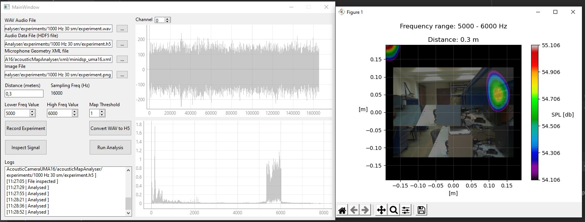

# Acoustic Array Map Analyser

## _Test project for Acoustic Array MiniDSP UMA-16_



## Dependencies

| _Library_  | _Version_ |
| ------     | ------    |
| PyQT       |  6        |
| Tables     |  3.6.1    |
| Acoular    |  21.05    |
| NumPy      |  1.20.3   |
| scipy      |  1.7.1    |
| opencv     |  4.5.3.56 |
| Pillow     |  8.3.2    |
| matplotlib |  3.4.3    |
| pyqtgraph  |  0.12.3   |
| PyAudio    |  0.2.11   |

## Install dependencies
```shell
pip install -r requirements 
```

## How to start
- Windows CMD/Powershell
``` cmd
 ./start.bat
```
- Bash
``` bash
 ./start.sh
```
